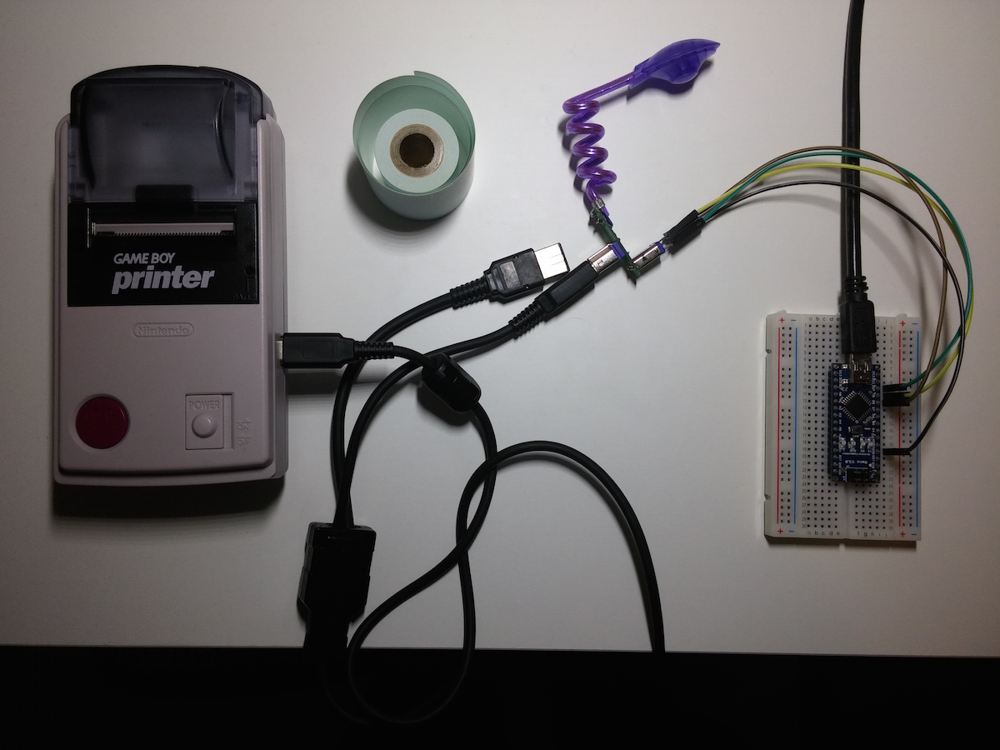
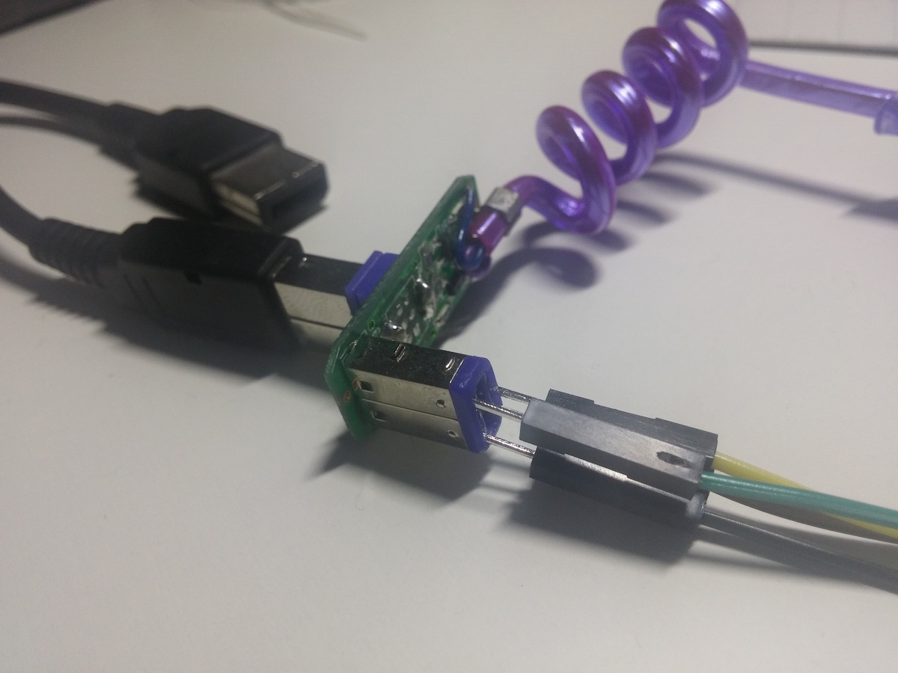
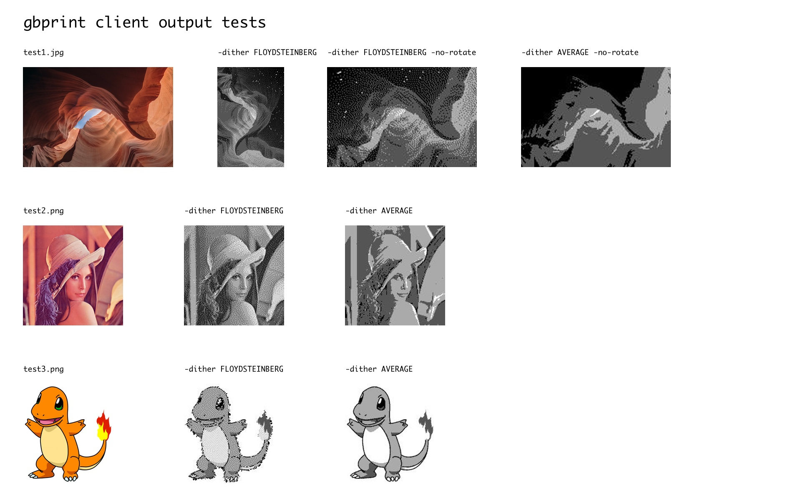

# Game Boy Printer Arduino Library

This arduino library and go client make it possible to connect a [Game Boy Printer](https://en.wikipedia.org/wiki/Game_Boy_Printer) to any computer and print an image of your choice.

## Installation and setup

### Arduino
To upload the firmware to your arduino device open `arduino/src/src.ino` with
the Arduino IDE and follow the usual upload process. No extra steps are needed.

The Game Boy Printer has a second generation [Game Link](https://en.wikipedia.org/wiki/Game_Link_Cable) cable interface. Its pinout is as follows

    Female port pinout          Male port pinout
         __^__                       __^__ 
        /5 3 1\                     /1 3 5\
        |6 4 2|                     |2 4 6|
         -----                       -----

1. VCC (5v)
2. Serial Out
3. Serial In
4. Serial Data
5. Clock
6. Ground

Serial In and Out are crossed in the GameLink cable, to enable full duplex
communication (albeit is not used here). For this project, we will only need
to wire serial in, out, clock and ground to the arduino, as follows:

- Serial Clock > D8
- Serial In > D9
- Serial Out > D10
- Ground > Ground

The arduino ports are defined on `/arduino/src/gbprinter.h`. No more electronic
components are needed. The pullup resistor referred to by other sources, such
as Furrtek, can be managed by the internal Arduino resistors just fine (check
`setup()` function on `/arduino/src/src.ino`).

I dismantled a Game Boy Worm Light to get a board where I could plug
jumper cables easily, without the need to damage the port on my Game
Boy Printer, or my Game Link cable. So far it has worked quite well, and with
some soldering it would be easy to attach the jumper cables directly to
the board for a more permanent setup.

### Go Client
Building the client in go (>=1.3) is simple:

    go get github.com/nfnt/resize
    go get github.com/tarm/serial
    go build gbprint.go

As an example, let's assume that the Arduino is listening to serial port `/dev/tty.usb1`
and we want to print `awesome_cat.jpg`:

    ./gbprint -serial /dev/tty.usb1 awesome_cat.jpg

Wait for a bit and soon enough your Game Boy Printer will be onto it.

If you just want to test the client for a bit, see what sort of output you can
expect from your printer, there is also the option to output the resulting image
to a file (instead of printing):

    ./gbprint -save out.jpg doc/test1.jpg  # Image as sent to the printer
    ./gbprint -save out.jpg -no-rotate doc/test1.jpg  # Don't rotate
    ./gbprint -save out.jpg -no-resize doc/test1.jpg  # Don't resize
    ./gbprint -save out.jpg -no-resize -no-rotate doc/test1.jpg
    ./gbprint -save out.jpg -dither AVERAGE doc/test1.jpg  # Use avg dithering instead of Floyd Steinberg

As expected, you can invoke gbprint with `--help` to get the full list of available options.

Here is a chart with some test images. As you can see, depending on the input, it might be more
interesting to use different dithering algorithms.

## Previous work and references
This could not have existed without the awesome reverse engineering work done by
Furrtek, which was the first (to my knowledge) to uncover the GBPrinter protocol
and inner hardware details.

The work from milesburton and davedarko has also been very helpful to translate
the firmware published by Furrtek (originally for an ATtiny85) to the Arduino.

The main addition of this fork is the work that has been done on the interface
Arduino - PC, which now allows to easily transform and transfer an arbitrary
image to the printer. Also, the compilation of sources and information available
on this README should be quite useful to anybody trying to figure out how this
works.

A list of references I've used throughout the project:

- [Anonymous GBPrinter Interface Specification](https://milesburton.com/File:Gameboy_Printer_Protocol.docx)
- [Furrtek GBPrinter hardware and package format details (French)](http://furrtek.free.fr/index.php?p=crea&a=gbprinter)
- [Furrtek making of a Game Boy Link cable to USB](http://furrtek.free.fr/index.php?p=crea&a=gbpcable&i=2)
- [Davedarko GitHub repo](http://github.com/davedarko/GBPrinter)
- [Davedarko GBPrinter posts (German)](http://davedarko.com/blog.php?tag=gameboy%20printer)
- [Miles Burton wiki](http://milesburton.com/Gameboy_Printer_with_Arduino)

### Overall design
This GBPrinter driver is designed as 2 state machines working in conjuction.
The main state machine controls the flow of data PC-Arduino, while the secondary
deals with the communication Arduino-Printer.

### Package format
- 6 bytes header
- up to 640 bytes of payload
- 4 bytes trailer

    HEADER                      PAYLOAD TRAILER
    0         2   3   4         6       646       648
    0x88 0x33 CMD RLE SZLO SZHI DATA    CKLO CKHI 0x00 0x00

    CMD: Game Boy Printer command
        0x01 > INITIALIZE (Prepare printer for transfer)
        0x02 > PRINT (Print transferred data)
        0x04 > TRANSFER (Send image data)
        0x0F > REPORT (Get Printer status)
    
    RLE: Set to either 0x00 or 0x01. Indicates if RLE encoding compression is
         used in the payload
    
    SZLO & SZHI: little endian uint16_t. Indicates payload size

    DATA: Packet payload. Its significance varies depending on command

    CHKLO & CHKHI: little endian uint16_t. Checksum calculated by adding together
                   packet data from byte 2 (CMD) to the end of PAYLOAD

    The first 2 bytes are sync bytes. The last 2 bytes are employed to read the
    printer status. Every time you send a byte, the printer will reply, but only
    the response on the last 2 bytes of the packet will return information
    about the printer status.

#### INITIALIZE

    CMD: 0x01
    RLE: 0x00
    SIZE: 0x0000
    DATA: None

    Expected response: 0x8100 or 0x8108

One of this packages must be sent before transferring data to the printer

#### PRINT

    CMD: 0x02
    RLE: 0x00
    SIZE: 0x0400
    DATA: 0x01 0x00 0xE4 0x40

First data byte purpose is unknown. 2nd indicates margin. First 4 bytes
for top margin, last 4 for bottom. 3rd and 4th byte indicate palette and
contrast. These are the default values usually employed.

#### TRANSFER

    CMD: 0x04
    RLE: 0x00
    SIZE: Up to 640 bytes
    DATA: Image buffer

    Expected response: 0x8100 or 0x8108

The printer can accept as much as 9 transfers of size 640bytes before
fully loading its internal buffer.

#### REPORT

    CMD: 0x0F
    RLE: 0x00
    SIZE: 0x0000
    DATA: None

This will return the Printer status. A report command can be sent during
any phase of the printing process. It's especially useful to ping the
printer to detect whenver the printer has finished the printing task.

### Error codes
The last bit of the Printer status code has the following flag system:

- b0: Bad Checksum
- b1: Currently printing
- b2: Printing requested
- b3: Ready to print
- b4: Voltage too low
- b5: ????
- b6: Paper jam
- b7: Too hot / cold

### Tests
There is a test suite for the firmware, that mocks the Arduino Library. To build
it you will need `scons`.

    git submodule update --init --recursive  # This will download the mock libs
    cd arduino
    scons  # This builds and runs the tests

TODO: The test suite is a bit broken at the moment, but it was quite useful to
test concepts and make sure that things like state transitions or the circle
buffer worked properly.

## Client

### Communication Protocol
Communication with the Arduino is done via the serial port interface, at 9600
bauds. The lifecycle of printing an image buffer is as follows:

    < Send uint32, little endian, with byte length of image buffer
    > Receive uint32, little endian, with expected payload byte length [maxPayloadLength]
    < Send b"OK"
    > Receive b"OK" if all is good. Arduino ready to receive image payload
      > If b"KO" received, something went wrong. Arduino resets state and client aborts
    < Send imageBuffer[:maxPayloadLength]
    > Receive b"OKxx" xx are the 2 gbprinter status bytes. The give more insight on
      internal hardware state. The printer will only reply once it has printed the
      data that was sent in the previous package
      > If b"KOxx" the printer could not complete the print request. Check status
        bytes for more info on the error and abort the process
    ^ Repeat the last 2 steps until the whole imageBuffer has been sent

### Image processing
Since the Game Boy Printer has such a limited color palette (2 bit grayscale)
and image width (160px) we need an algorithm to downscale, rotate and dither
images to get the best result possible on paper.

As a first step, the go client will rotate the image so that it's length is
larger or equal to the width (maximizing image real estate) and convert it to
grayscale. Once it is in grayscale, it will dither the image from 8bit to 2bit.
By default it uses the Floyd Steinberg algorithm (`-dither FLOYDSTEINBERG`), which is good at preserving
detail and works well with real world images (although this printer is not
precisely the best for highly detailed stuff). If you plan on printing
illustrations, text, or want more contrast, you might be better off using
an average dither (`-dither AVERAGE`).

### Image format
Game Boy Printer images have a fixed width of 160px and unlimited length (as
long as the paper or battery last). An image can be further decomposed in pages,
bands and tiles.

**Tile:** A 8x8 fragment of the image.

**Band:** A 160x16 fragment of the image, or 40 tiles. This is the minimum image
fragment that can be sent to the printer.

**Page:** A group of up to 9 bands. The buffer of the printer will hold a max of
9 bands before a print command has to be issued. Since it's possible to print
0-margin images, a full image can be completed successfully by chain-printing
multiple pages together.

The Game Boy Printer has 2 bit grayscale color depth:

    00 > White
    01 > Light Gray
    10 > Dark Gray
    11 > Black

### Image Serialization
Images must be serialized tile-by-tile. That is, tiles being sent left to right.
Tiles (8x8 pixels) are sent top-down, left-right. Since color depth is 2bit,
each byte will contain 4 pixels.

### Options
Input images can be in GIF, PNG and JPEG formats. Output, if saved to file, is
JPEG. Use `--help` to explore command flags. At this moment, both `-no-rotate`
and `-no-resize` only take effect when saving the output to file, not when
printing.

